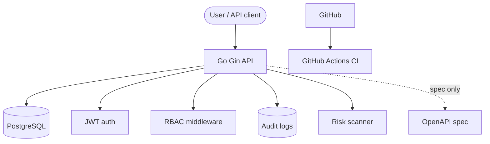

# SecureVault CloudGuard

A cloud-native secrets access, RBAC, audit logging, and risk scanning backend built with **Go**, **Gin**, **PostgreSQL**, **Docker Compose**, **JWT**, **OpenAPI**, **GitHub Actions**, and a **Dockerfile** for the API.

This is a **portfolio / learning project** I built step by step. **It is not a production product.** The backend is **also deployed on Render** for demonstration: **`https://securevault-api-5t61.onrender.com`** ([`docs/render-deployment.md`](docs/render-deployment.md)). No **frontend** is deployed with this README.

## Project status

- **Backend MVP:** Runnable locally (Docker Compose + `go run`)—see [`backend/README.md`](backend/README.md)—or **`docker build`**. **Live demo:** [`https://securevault-api-5t61.onrender.com`](https://securevault-api-5t61.onrender.com) (**Render**, portfolio use only; details in [`docs/render-deployment.md`](docs/render-deployment.md)).
- **Docker image:** `backend/Dockerfile` builds **`securevault-api`**.
- **Live database (Render demo):** **Render PostgreSQL**; **`001_init.sql`** and **`002_seed_users.sql`** were applied manually using the dashboard’s external DB access (**no connection strings in this repo**).
- **Frontend:** Not built or deployed yet.
- **GCP / Cloud Run:** Documented as a **future or alternative path** in [`docs/cloud-run-deployment.md`](docs/cloud-run-deployment.md)—that GCP project needed **billing to enable APIs**, so Render was chosen for this live milestone.
- **Google Secret Manager:** Planned as a cloud improvement; **not** wired into the codebase today (`secret_ref` and simulated access are educational).
- **Final review / interview prep:** Markdown in [`docs/project-review/`](docs/project-review/) (checklist, talking points, Q&A, roadmap)—see **Final review package** below.

## Why I built this

I built SecureVault CloudGuard to get hands-on with **cloud-style backend engineering**: how APIs separate **authentication** from **authorization**, how **IAM-style RBAC** might map onto HTTP routes, and how **DevSecOps-minded** touches—**audit trails**, **risk signals over metadata**, and **clear API contracts**—fit together. I wanted something I could run locally, reason about in interviews, and honestly describe as **student-built but serious**, not corporate marketing.

## Cloud DevSecOps alignment

Topics this project practices in a small, local setting:

- **GCP / Cloud Run deployment planning** — optional guide when billing/API access is available; **Render** is what runs the current live demo ([`docs/render-deployment.md`](docs/render-deployment.md)).
- **IAM-style RBAC** — JWT claims + middleware: admin / developer / viewer with different route access.
- **Secret Manager–style design** — metadata + `secret_ref` in the model; real secret values are not returned; cloud secret store is the natural extension.
- **Cloud security governance** — thinking in terms of who can create secrets, who can “access” (simulated), and what gets logged.
- **Audit logging** — persist security-relevant actions to `audit_logs` (login, secret lifecycle, risk scan).
- **Risk scanner** — rule-based findings from **metadata only** (no plaintext secrets).
- **API documentation** — OpenAPI 3 spec for clients and tools.
- **CI checks** — format, vet, test, build, spec file present on every push/PR to `main`.
- **Docker + PostgreSQL** — local database via Compose; production would move to managed SQL.

## Features implemented

- [x] Go + Gin API
- [x] **`Dockerfile`** for the backend (`backend/Dockerfile` → image **`securevault-api`**)
- [x] PostgreSQL using Docker Compose
- [x] JWT authentication
- [x] Admin / Developer / Viewer RBAC
- [x] Secret metadata registry (`secret_ref`; no plaintext in list/detail)
- [x] Controlled **simulated** secret access endpoint (demo response only)
- [x] Audit logging (Postgres)
- [x] Risk scanner (metadata-only rules; persisted findings)
- [x] Dashboard summary API (counts + recent audit rows)
- [x] OpenAPI documentation (`backend/docs/openapi.yaml`)
- [x] **Live backend on Render** (HTTPS demo—not production SLA)
- [x] Cloud Run deployment **documentation** (**alternative/future path**; not used for current live demo)

## Not implemented yet / honest limitations

- No **frontend** dashboard or frontend hosting yet.
- **Hosted Render instance** is a **portfolio smoke-test tier**: possible **cold starts**, **demo users**, **not** audited for production workloads.
- No **Google Secret Manager** integration in code.
- No **production SSO / OAuth** (email + password demo users only—even on Render, until you replace them).
- **GCP Cloud Run:** not deployed for this milestone (APIs required **billing** on the GCP project used); [**`docs/cloud-run-deployment.md`**](docs/cloud-run-deployment.md) stays the reference for later.
- No **policy engine** beyond **role-based** route checks (no per-resource policy API).
- No **automated** Docker deploy pipeline in GitHub Actions.
- Locally you still rely on **Docker Compose** Postgres unless you repoint **`DATABASE_URL`** yourself.

## Architecture summary



## Tech stack

| Area | Choice |
|------|--------|
| **Backend** | Go 1.22+, Gin |
| **Database** | PostgreSQL (local Docker Compose; **Render Postgres** for the live demo) |
| **Deployed demo** | [Render Web Service](https://securevault-api-5t61.onrender.com) + Render PostgreSQL ([`docs/render-deployment.md`](docs/render-deployment.md)) |
| **Auth** | JWT (HS256), bcrypt password hashes |
| **DevOps** | Docker Compose, Docker image (`backend/Dockerfile`), GitHub Actions CI |
| **Docs** | OpenAPI 3.0.3 (`backend/docs/openapi.yaml`), Markdown in `docs/` ([**Render**](docs/render-deployment.md), [**Cloud Run**](docs/cloud-run-deployment.md) notes) |
| **GCP (alternative)** | Cloud Run guide when billing/APIs are enabled—see **`docs/cloud-run-deployment.md`** |

## API overview

Base URLs:

- **Local:** `http://localhost:8080`
- **Render (portfolio demo):** `https://securevault-api-5t61.onrender.com`

| Path | Role |
|------|------|
| `GET /health` | Public |
| `GET /health/db` | Public |
| `POST /api/v1/auth/login` | Public |
| `GET /api/v1/auth/me` | Authenticated |
| `GET /api/v1/secrets` | Authenticated (list metadata) |
| `POST /api/v1/secrets` | **Admin** (create) |
| `GET /api/v1/secrets/{id}` | Authenticated |
| `PUT /api/v1/secrets/{id}` | **Admin** |
| `DELETE /api/v1/secrets/{id}` | **Admin** |
| `POST /api/v1/secrets/{id}/access` | **Admin / Developer** (simulated access) |
| `GET /api/v1/audit-logs` | **Admin** |
| `GET /api/v1/risks` | Authenticated |
| `POST /api/v1/risks/scan` | **Admin** |
| `GET /api/v1/dashboard/summary` | Authenticated |

RBAC probe routes under `/api/v1/rbac/*` and full request/response schemas are in **[`backend/docs/openapi.yaml`](backend/docs/openapi.yaml)** (import into Swagger Editor / Postman; the app does not serve Swagger UI).

## Local setup

1. **Clone** this repository.
2. Start **Docker Desktop** (or equivalent) so Compose can run.
3. From the repo root:

   ```bash
   docker compose up -d
   ```

4. Run **migrations** (schema + seed users):

   ```bash
   docker exec -i securevault-postgres psql -U securevault_user -d securevault_db < backend/internal/database/migrations/001_init.sql
   docker exec -i securevault-postgres psql -U securevault_user -d securevault_db < backend/internal/database/migrations/002_seed_users.sql
   ```

5. Start the API:

   ```bash
   cd backend
   go mod tidy
   go run ./cmd/api
   ```

Environment variables: see [`.env.example`](.env.example) and [`docs/environment-variables.md`](docs/environment-variables.md). More backend detail: [`backend/README.md`](backend/README.md).

## Demo users

| Name | Email | Password | Role |
|------|-------|----------|------|
| Admin User | admin@securevault.local | `Admin@123` | admin |
| Developer User | developer@securevault.local | `Dev@123` | developer |
| Viewer User | viewer@securevault.local | `Viewer@123` | viewer |

**These accounts are seeded locally and on Render for demos only—not for production reuse.** Prefer rotating them if you extend the deployed instance.

### Render demo (HTTPS)

After cold start, sanity checks (**no secrets pasted here**):

```bash
curl -s https://securevault-api-5t61.onrender.com/health
curl -s https://securevault-api-5t61.onrender.com/health/db
curl -s -X POST https://securevault-api-5t61.onrender.com/api/v1/auth/login \
  -H "Content-Type: application/json" \
  -d '{"email":"admin@securevault.local","password":"Admin@123"}'
```

## Quick API test commands (localhost)

```bash
export TOKEN=$(curl -s -X POST http://localhost:8080/api/v1/auth/login \
  -H "Content-Type: application/json" \
  -d '{"email":"admin@securevault.local","password":"Admin@123"}' \
  | python3 -c "import sys,json; print(json.load(sys.stdin)['token'])")

curl -s http://localhost:8080/health

# Create secret metadata (admin)
curl -s -X POST http://localhost:8080/api/v1/secrets \
  -H "Authorization: Bearer $TOKEN" \
  -H "Content-Type: application/json" \
  -d '{"name":"demo-key","environment":"dev","owner":"me","service":"api","secret_ref":"local/demo/demo-key"}'

# Risk scan (admin)
curl -s -X POST http://localhost:8080/api/v1/risks/scan \
  -H "Authorization: Bearer $TOKEN"

# Audit logs (admin)
curl -s "http://localhost:8080/api/v1/audit-logs?limit=5" \
  -H "Authorization: Bearer $TOKEN"

# Dashboard summary
curl -s http://localhost:8080/api/v1/dashboard/summary \
  -H "Authorization: Bearer $TOKEN"
```

## Security design (as implemented)

- **Passwords:** Stored as **bcrypt** hashes in Postgres (demo users from seed migration).
- **JWT:** Stateless bearer tokens for API access after login.
- **RBAC:** Middleware enforces **admin / developer / viewer** differences on routes (not a full enterprise IAM product).
- **Secrets:** Only **metadata** and **`secret_ref`** are stored and returned in normal CRUD; **plaintext secret values are not exposed**; the access route returns a **simulated** payload for learning.
- **Audit logs:** Persist actions like login and secret mutations for investigation-style practice.
- **Risk scanner:** Evaluates **metadata only** (e.g. missing owner, prod without owner); no secret material.
- **Configuration:** Local dev uses `.env` / `.env.example` (**never commit** real secrets). The **Render** service uses **`DATABASE_URL`** and **`JWT_SECRET`** configured **only** in Render’s dashboard ([`docs/render-deployment.md`](docs/render-deployment.md)). A stricter setup would mirror **Secret Manager–style** secret stores for clouds other than local demos.

## Continuous integration

Workflow: **[`.github/workflows/ci.yml`](.github/workflows/ci.yml)** (runs on push and PRs to **`main`**).

Checks:

- **`gofmt`** (must be clean)
- **`go vet ./...`**
- **`go test ./...`**
- **`go build`** for `./cmd/api`
- **OpenAPI file exists:** `backend/docs/openapi.yaml`

No database service in CI, no image publish, no deploy.

## Documentation links

| Resource | Description |
|----------|-------------|
| [`backend/docs/openapi.yaml`](backend/docs/openapi.yaml) | Full OpenAPI contract |
| [`docs/architecture.md`](docs/architecture.md) | Local vs planned GCP diagrams |
| [`docs/environment-variables.md`](docs/environment-variables.md) | Env vars & safety notes |
| [`docs/render-deployment.md`](docs/render-deployment.md) | Live **Render** deployment (portfolio demo HTTPS + Postgres migrations) |
| [`docs/cloud-run-deployment.md`](docs/cloud-run-deployment.md) | Optional **GCP Cloud Run** walkthrough (alternative when billing/APIs enabled) |

## Final review package

These documents are for **self-review**, **interview preparation**, and **planning improvements**—not part of the running API:

| Doc | Purpose |
|-----|---------|
| [`docs/project-review/final-checklist.md`](docs/project-review/final-checklist.md) | Pre-demo / pre-share checklist (local, API, security, docs, CI) |
| [`docs/project-review/interview-notes.md`](docs/project-review/interview-notes.md) | Timed explanations and themes in first person |
| [`docs/project-review/interview-questions.md`](docs/project-review/interview-questions.md) | Fifteen likely Q&A answers tied to this repo |
| [`docs/project-review/future-roadmap.md`](docs/project-review/future-roadmap.md) | Short / medium / long backlog |

## How I would explain this in an interview

> “SecureVault CloudGuard is a **cloud-security-focused backend** I built to practice **secret metadata**, **JWT auth**, **RBAC middleware**, **audit trails**, and a **metadata-only risk scanner**—honest about **simulated secret access**. I ran it locally with **Postgres via Docker Compose**, shipped a **portfolio HTTPS instance on Render**, and wrote **GCP Cloud Run notes as an alternate path** when **billing/API access** wasn't the right choice for my GCP sandbox. Still no **frontend**—that’s deliberate scope.”

## What I learned

- Go module layout and a small **clean architecture** split (handlers, services, repositories).
- Deploying **Go + Dockerfile** behind **HTTPS** on **Render** and wiring **managed Postgres** (portfolio demo tier).
- **Gin** routing, JSON binding, and middleware chains.
- **PostgreSQL** schema + SQL migrations with `database/sql`.
- **Docker Compose** for a dev database.
- **JWT** issuance/validation and **bcrypt** for passwords.
- **RBAC** enforcement at the HTTP layer.
- **Audit logging** that does not break the main flow on insert failure (MVP choice).
- **Risk rules** over metadata and persisting findings.
- **OpenAPI** as the contract for tools and teammates.
- **GitHub Actions** for repeatable quality gates.
- Reading **Cloud Run / Artifact Registry** docs and turning them into a **checklist** for future me.

## Future improvements

- **Next.js** (or similar) dashboard consuming the summary + list APIs.
- **Google Secret Manager** (and Cloud SQL) integrated for real cloud secrets and DB connectivity.
- **Terraform** (or IaC of choice) for reproducible infra.
- **Policy engine** beyond fixed roles (e.g. environment-scoped rules).
- **Unit and integration tests** (including DB-backed tests where appropriate).
- **GitHub Actions** pipeline to **build/push** Docker images (no deploy unless you add it).
- **Cloud Monitoring** alerts and uptime checks once something is actually hosted.

## License

**License to be added** (e.g. MIT)—this repo does not yet include a `LICENSE` file.
