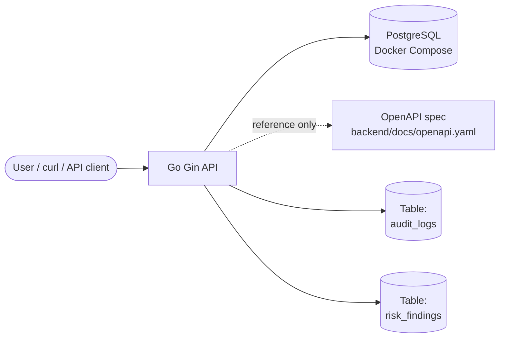
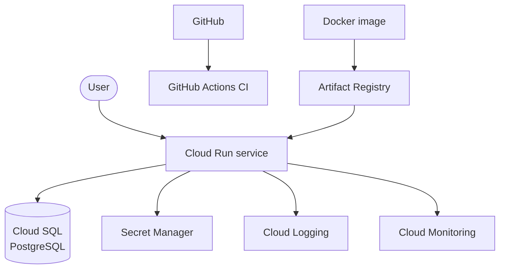

# SecureVault CloudGuard architecture

## Project overview

SecureVault CloudGuard is a **portfolio-focused** Go + Gin API that explores patterns around **secret metadata** (not plaintext values in list/detail routes), **JWT authentication**, **RBAC**, **audit logging**, **risk scanning**, and a **dashboard summary** endpoint. The optional OpenAPI spec describes the HTTP surface; **GitHub Actions CI** validates the backend on each change.

This document describes **how the system is structured today** (mostly on your laptop) and a **realistic future shape** on Google Cloud. **Nothing in this repository is claimed to be deployed to production** unless you complete those steps yourself.

## Current local architecture

Today the project is built for **local development**:

- The **Go Gin API** runs on your machine (for example `go run ./cmd/api` from `backend/`).
- **PostgreSQL** runs in **Docker Compose** (`docker-compose.yml`), not in the same process as the API.
- **OpenAPI** lives as a static file at `backend/docs/openapi.yaml`; it is **not** generated or served by the API in the MVP.
- **Audit events** are written to the **`audit_logs`** table in Postgres.
- **Risk scan results** are stored in the **`risk_findings`** table.
- **Simulated secret access** returns a safe demo payload and does **not** expose real secret material; there is **no** Google Secret Manager integration in the current code.

### Local architecture (Mermaid)

Solid arrows are runtime data paths. The OpenAPI file is **maintained alongside** the project and imported into tools like Swagger Editor; the API does not host Swagger UI.

## Future GCP architecture (planned)

A **production-style** deployment would typically:

- Run the API as a **Cloud Run** service (containerized, auto-scaling, HTTPS front door).
- Use **Cloud SQL for PostgreSQL** instead of Docker Compose on a single machine.
- Store **long-lived secrets** (for example `JWT_SECRET`, database credentials) in **Secret Manager**, not in source control.
- Rely on **Cloud Logging** for platform and request logs, and **Cloud Monitoring** for SLO-style metrics and alerts.
- Keep **application audit rows** in Postgres (`audit_logs`) unless you later export or dual-write elsewhere.
- Build a **container image** (for example with Docker), push it to **Artifact Registry**, and deploy that image to Cloud Run.
- Keep **GitHub Actions CI** as a quality gate (this repo already has a workflow); **deploy automation** is out of scope for the current project phase.

**Google Secret Manager** integration for *application* secrets (distinct from the product’s “secret registry” metadata) is a **future improvement**—the API’s `secret_ref` and simulated access remain educational, not a full secrets backend.

### Planned GCP architecture (Mermaid)

The arrow from **Docker image** to **Artifact Registry** represents **pushing** a built image; **Cloud Run** then pulls from Artifact Registry when you deploy.

## Honest scope notes

- **Local Postgres (Docker)** is appropriate for development. **Production** should use a **managed** database (for example Cloud SQL) with backups, networking, and access control you define.
- **This project is not pre-deployed** for you. Follow [cloud-run-deployment.md](cloud-run-deployment.md) only if you choose to deploy; until then, treat Cloud Run as **documentation and planning** only.
- **Simulated secret access** is intentional for learning; wiring real secret retrieval from **Secret Manager** would be a separate feature.
